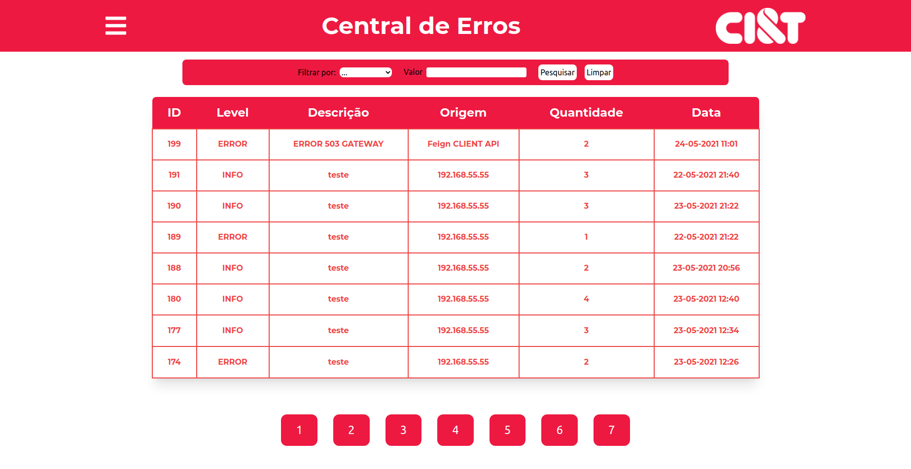

# Bem vindo ao front-end do **Central de erros**!
Este é o front-end do projeto de conclusão do Acelera Dev Java Online, proporcionada pela CI&T e Trybe!
Aqui está a representação em uma aplicação Web da força da nossa [API](https://github.com/PedroMarqdev/CentralErrosCodenation).

> Por amor e agradecimento a CI&T,  o projeto foi estilizado inteiramente com a branding da CI&T.

## Grupo
- Pedro Paulo Marques da Costa [Github](https://github.com/PedroMarqdev) [Linkedin](https://www.linkedin.com/in/pedro-marques-9aaa651b4/)
- Vitor
- Berilo

## Tecnologias
- React (React-router, Hooks)
- Redux.js
- TailwindCSS

# Aplicação!
> [Site](https://central-errors.vercel.app/)
> Não é possível acessar a Dashboard da aplicação sem estar autenticado.

## Tela de **Login**

Aqui há a possibilidade de logar com o usuário e também ir até a página de registro para criar um novo login.
Ao clicar em central de erros, será redirecionado para a tela de login.
## Tela de **Registro**

Aqui é possível cadastrar o usuário e ao ter sucesso, será redirecionado uma mensagem de feedback. Caso não, terá alertas ou o campo tremerá para demonstrar
o que está errado. Após isso, uma tela aparecerá perguntando se você quer ir para a tela de login.
## Tela do **Dashboard**

O coração da aplicação, o Dashboard. Aqui é possível visualizar todos os logs divididos em tabelas, ao clicar em algum, mostrará uma informação adicional do log em formato de pop up.
### Filtragem
No campo médio superior podemos filtrar por diversos campos, como:
- Id
- Descrição
- Level
- Origem
- Data | Inicío e fim (Intervalo)

> Ao clicar em cada atributo do header da tablela, é filtrado por ordem do atributo selecionado.

## Tela do **Cadastro de Logs**
Aqui não há segredo, é possível cadastrar um novo log inserindo as informações necessárias.

## Instalação
Para instalar as dependências do projeto, você pode utilizar:
### `yarn test`
E para abrir a aplicação, você pode utilizar:
### `yarn start`
